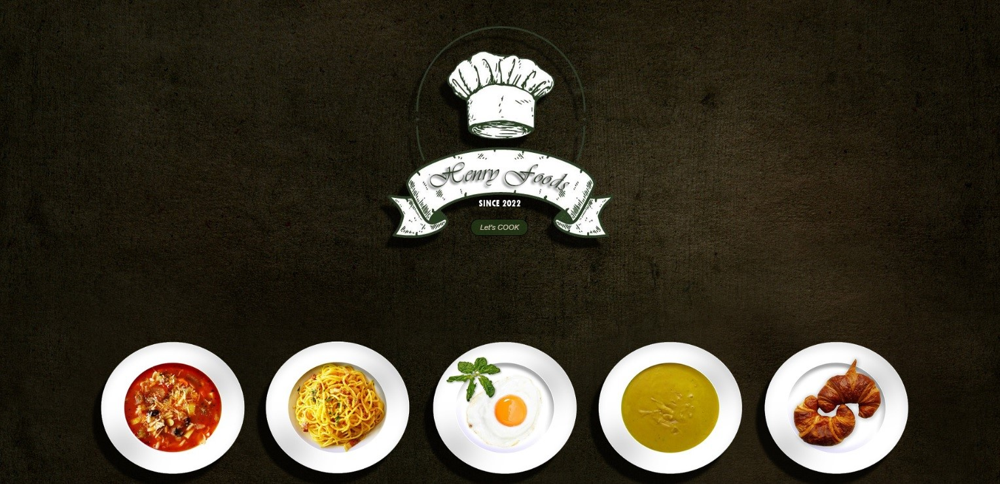
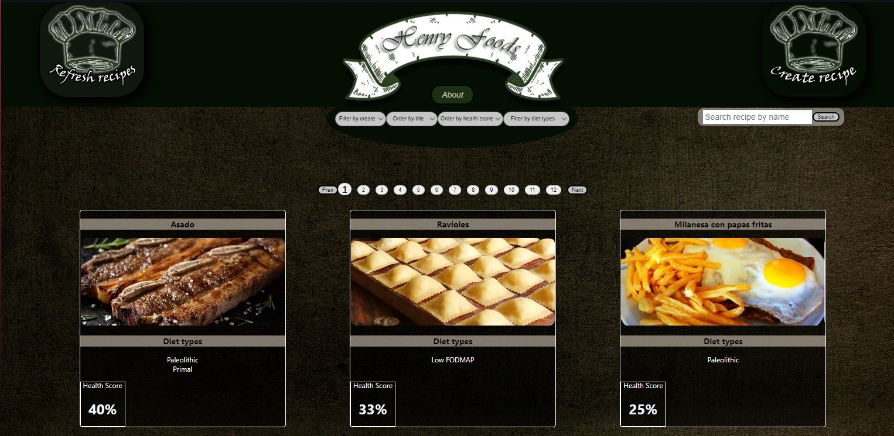
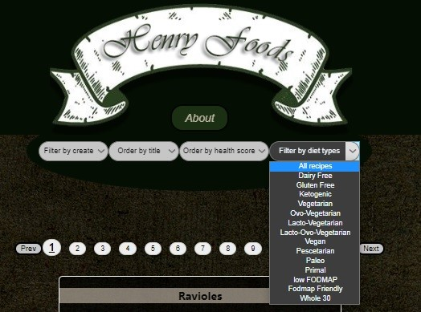
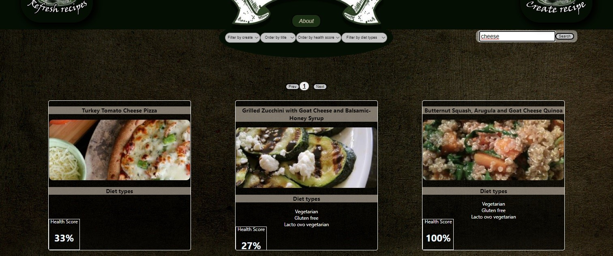
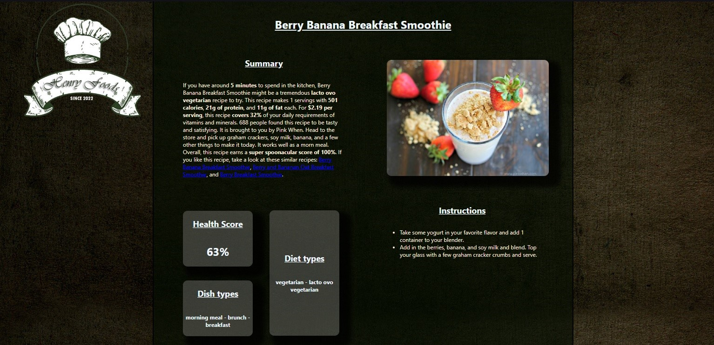
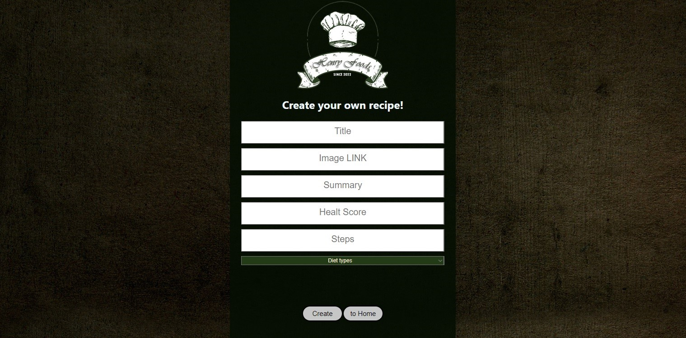

# Individual Project - Henry Food
## Objetivos del Proyecto

- Construir una App utlizando React, Redux, Node y Sequelize.
- Afirmar y conectar los conceptos aprendidos en la carrera.
- Aprender mejores prácticas.
- Aprender y practicar el workflow de GIT.
- Usar y practicar testing.


**IMPORTANTE:** Es necesario contar minimamente con la última versión estable de Node y NPM. Asegurarse de contar con ella para poder instalar correctamente las dependecias necesarias para correr el proyecto.


Actualmente las versiónes necesarias son:

- **Node**: 12.18.3 o mayor
- **NPM**: 6.14.16 o mayor

Para verificar que versión tienen instalada:

```bash
node -v
npm -v
```

**ACLARACIÓN:** Las dependencias actuales se encuentran en las versiones que venimos trabajando durante el bootcamp.

Versiones:

- **react**: 17.0.1
- **react-dom**: 17.0.1
- **react-router-dom**: 5.2.0
- **redux**: 4.0.5
- **react-redux**: 7.2.3


## Enunciado

La idea general es crear una aplicación en la cual se puedan ver distintas recetas de comida junto con información relevante de las mismas utilizando la api externa [spoonacular](https://spoonacular.com/food-api) y a partir de ella poder, entre otras cosas:

- Buscar recetas
- Filtrarlos / Ordenarlos
- Crear nuevas recetas propias

**IMPORTANTE**: Para poder utilizar esta API externa es necesario crearse una cuenta para obtener una API Key que luego debera ser incluida en todos los request que hagamos a spoonacular simplemente agregando `?apiKey={YOUR_API_KEY}` al final de cada endpoint. Agregar la clave en el archivo `.env` para que la misma no se suba al repositorio por cuestiones de seguridad y utilizarla desde allí. Por otro lado tienen un límite de requests por día por lo que usenlos con cuidado!


#### Tecnologías necesarias
- [ ] React
- [ ] Redux
- [ ] Express
- [ ] Sequelize - Postgres

## Frontend

Se debe desarrollar una aplicación de React/Redux que contenga las siguientes pantallas/rutas.

**Pagina inicial**: deben armar una landing page con

- [ ] Alguna imagen de fondo representativa al proyecto
- [ ] Botón para ingresar al home (`Ruta principal`)

**Ruta principal**: debe contener

- [ ] Input de búsqueda para encontrar recetas por nombre
- [ ] Área donde se verá el listado de recetas. Deberá mostrar su:
  - Imagen
  - Nombre
  - Tipo de dieta (vegetariano, vegano, apto celíaco, etc)
- [ ] Botones/Opciones para filtrar por por tipo de dieta
- [ ] Botones/Opciones para ordenar tanto ascendentemente como descendentemente las recetas por orden alfabético y por health score (nivel de comida saludable).
- [ ] Paginado para ir buscando y mostrando las siguientes recetas, 9 recetas por pagina, mostrando las primeros 9 en la primer pagina.

**IMPORTANTE**: Dentro de la Ruta Principal se deben mostrar tanto las recetas traidas desde la API como así también las de la base de datos. Debido a que en la API existen alrededor de 5 mil recetas, por cuestiones de performance pueden tomar la simplificación de obtener y paginar las primeras 100.

**Ruta de detalle de receta**: debe contener

- [ ] Los campos mostrados en la ruta principal para cada receta (imagen, nombre, tipo de plato y tipo de dieta)
- [ ] Resumen del plato
- [ ] Nivel de "comida saludable" (health score)
- [ ] Paso a paso

**Ruta de creación de recetas**: debe contener

- [ ] Un formulario **controlado con JavaScript** con los siguientes campos:
  - Nombre
  - Resumen del plato
  - Nivel de "comida saludable" (health score)
  - Paso a paso
- [ ] Posibilidad de seleccionar/agregar uno o más tipos de dietas
- [ ] Botón/Opción para crear una nueva receta

> Es requisito que el formulario de creación esté validado con JavaScript y no sólo con validaciones HTML. Pueden agregar las validaciones que consideren. Por ejemplo: Que el nombre de la receta no pueda contener símbolos, que el health score no pueda exceder determinado valor, etc.


## Backend

Se debe desarrollar un servidor en Node/Express con las siguientes rutas:

**IMPORTANTE**: No está permitido utilizar los filtrados, ordenamientos y paginados brindados por la API externa, todas estas funcionalidades tienen que implementarlas ustedes.

- [ ] **GET /recipes?name="..."**:
  - Obtener un listado de las recetas que contengan la palabra ingresada como query parameter
  - Si no existe ninguna receta mostrar un mensaje adecuado
- [ ] **GET /recipes/{idReceta}**:
  - Obtener el detalle de una receta en particular
  - Debe traer solo los datos pedidos en la ruta de detalle de receta
  - Incluir los tipos de dieta asociados
- [ ] **POST /recipes**:
  - Recibe los datos recolectados desde el formulario controlado de la ruta de creación de recetas por body
  - Crea una receta en la base de datos relacionada con sus tipos de dietas.
- [ ] **GET /diets**:
  - Obtener todos los tipos de dieta posibles
  - En una primera instancia, cuando no exista ninguno, deberán precargar la base de datos con los tipos de datos indicados por spoonacular [acá](https://spoonacular.com/food-api/docs#Diets)

## Screenshots

## Landing Page



## Home



## Filtros



## Search Bar



## Detalle de receta y paso a paso



## Formulario de creación



